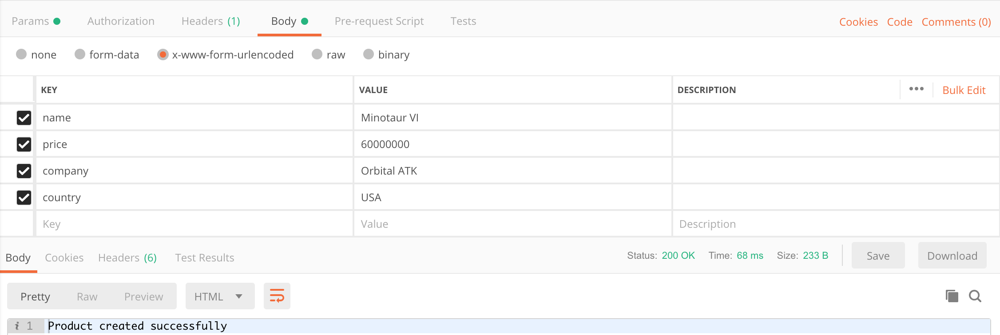

# node-crud-server 
---

## Space Rockets 

### Server Deployed Via Heroku

### [Routes](routes/product.route.js)

  * "/all" -  gets all the items in the database
  * "/name/:name" - Lets you search for a rocket by name
  * "/country/:country" - Lets you filter data by country

### Adding a New Rocket Via Postman

Name: "Rocket Name" 

Price: "Rocket Price"

Company: "Company Name"

Country "Country of Origin"

